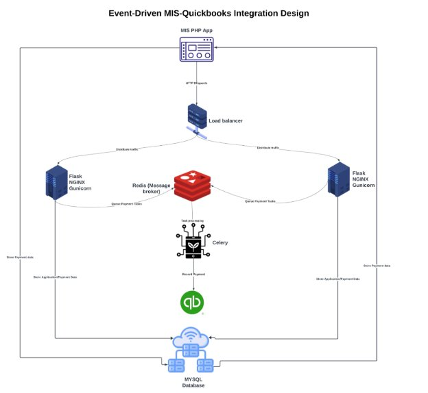



Project: Real-Time MIS–QuickBooks Integration & System Modernization 

Phase 1  – Foundation & Planning Deliverables Report Client: East African University Rwanda (EAUR)

Service Provider: ACR-Online Accounting Services Ltd Date: August 1 7, 2025

**Table of Contents:**

1. [Executive Summary .................................................................................................. 3 ](#_page2_x69.00_y186.00)
1. [Project Overview....................................................................................................... 3 ](#_page2_x69.00_y545.00)
1. [Integration Scope – Online Student Application ........................................................... 4 ](#_page3_x69.00_y260.00)
1. [Proposed Technical Approach ................................................................................... 4 ](#_page3_x69.00_y484.00)
1. [Event-Driven Data Push........................................................................................ 4 ](#_page3_x69.00_y529.00)
1. [Applicant Data Mapping ....................................................................................... 5 ](#_page4_x69.00_y135.00)
5. [Supporting Endpoints (Microservice) .......................................................................... 6 ](#_page5_x69.00_y172.00)
6. [Database Schema Updates ....................................................................................... 7 ](#_page6_x69.00_y135.00)
6. [Invoicing Integration Scope ....................................................................................... 8 ](#_page7_x69.00_y194.00)
1. [Online Application ............................................................................................... 8 ](#_page7_x69.00_y255.00)
1. [Fields Pushed to QuickBooks ............................................................................... 8 ](#_page7_x69.00_y428.00)
1. [MIS Auto-Invoicing ............................................................................................... 9 ](#_page8_x69.00_y391.00)
1. [Payment Request Flow ......................................................................................... 9 ](#_page8_x69.00_y481.00)
1. [Prepayments ....................................................................................................... 9 ](#_page8_x69.00_y599.00)
8. [Payments Integration .............................................................................................. 10 ](#_page9_x69.00_y135.00)
9. [Database Access Permissions and Server ................................................................ 10 ](#_page9_x69.00_y552.00)
9. [Microservice Architecture Design ........................................................................... 11 ](#_page10_x69.00_y260.00)

   [10.1 System Architecture Diagram ........................................................................... 12 ](#_page11_x69.00_y135.00)

11. [Testing Environment Configuration......................................................................... 12 ](#_page11_x69.00_y595.00)
12. [Phase 1 Activities Log ............................................................................................ 13 ](#_page12_x69.00_y212.00)
12. [Risks & Mitigation ................................................................................................. 13 ](#_page12_x69.00_y382.00)
12. [Payment Gateway Status ....................................................................................... 13 ](#_page12_x69.00_y533.00)
12. [Stakeholder Meetings & Agreements (Minutes as Annexes) ...................................... 14 ](#_page13_x69.00_y135.00)
12. [Next Steps and Approval Request .......................................................................... 14 ](#_page13_x69.00_y235.00)
1. Executive Summary 

Phase 1 establishes the foundation for the Real-Time MIS–QuickBooks Integration & System Modernization Project, as outlined in the Service Contract dated July 9, 2025. This phase includes:  

- Requirements gathering with EAUR’s IT department and key stakeholders.  
- Database schema design to support automated QuickBooks synchronization.  
- Architecture planning for a secure, scalable Flask microservice.  
- Testing environment configuration for isolated development and validation. 

The purpose of this report is to:  

- Document the agreed technical approach.  
- Record detailed integration plans, including field mappings, schema updates, and database access needs.  
- Present the microservice architecture for client review and approval.  

Key achievements include confirmed requirements, proposed schema enhancements, and initial engagements with payment gateways. With approval, we can proceed to Phase 2 (Core Development). 

2. Project Overview 

Following the kick-off meeting with EAUR’s IT department, we reviewed the existing MIS infrastructure (PHP/MySQL on DigitalOcean), database schema, and payment workflows. We identified gaps, such as missing links between invoices and payments, and confirmed the need for real-time synchronization between MIS and QuickBooks Online to:  

- Eliminate manual double-entry.  
- Reduce human errors in financial records.  
- Improve reporting accuracy and timeliness.  
- Provide management with up-to-date financial insights. 

The integration will use an event-driven microservices approach, where changes in MIS (e.g., new applications, invoices, or payments) trigger automatic updates in QuickBooks within seconds. This aligns with the technical proposal's goals for bidirectional sync and fraud prevention. 

3. Integration Scope – Online Student Application 

The student application module initiates the financial relationship between EAUR and applicants. Integrating it with QuickBooks aims to:  

- Track applicants as potential students.  
- Streamline financial reporting by linking applicant data to fees.  
- Enhance visibility for admissions and finance teams. 

Once live:  

- New MIS applicants will create customer records in QuickBooks.  
- Application fees will post as invoices for payment tracking. 
4. Proposed Technical Approach 
1. Event-Driven Data Push 

A dedicated HTTP endpoint in the Flask microservice will receive POST requests from MIS on new applicant creation. The microservice will validate data, enrich it (e.g., convert IDs to names via DB queries), and push to QuickBooks API. Benefits:  

- Instant synchronization without manual intervention.  
- Reduced risk of missed records.  
- Easier MIS-QuickBooks reconciliation. 
2. Applicant Data Mapping 

Applicant fields mapped to QuickBooks Customer entity (POST /v3/company/{realmID}/customer):  

|**MIS Field** |**QuickBooks Field** |**Description/Notes** |
| - | - | - |
|tracking\_id |CustomField[TrackingID] |Custom field for unique applicant ID. |
|Applicant name |DisplayName (required) |Concatenate with tracking\_id for uniqueness (e.g., "John Doe - APP123"). Use GivenName/FamilyName for splits. |
|sex |CustomField[Gender] |Custom field, as QB lacks native gender field. |
|phone |PrimaryPhone |Primary contact number. |
|email |PrimaryEmailAddr |Primary email. |
|Country of birth |CustomField[BirthCountry] |Custom field. |
|National id/passport |CustomField[NationalID] |Custom field for ID storage. |
|Campus info |CustomField[Campus] |Enriched name (e.g., "Nyagatare"). |
|Intake info |CustomField[Intake] |Enriched details. |
|specialization/pro gram |CustomField[Program] |Enriched program name. |
|Prog\_mode |CustomField[ProgramMode] |e.g., "Evening". |
|payment\_details |Notes |Summary of initial payments; detailed in linked invoices/payments. |

This ensures QuickBooks stores enriched, readable data. Custom fields handle education-specific info; if more are needed, discuss under change control. 

5. Supporting Endpoints (Microservice) 

To enrich data (e.g., IDs to names), the Flask microservice will provide read-only endpoints querying the MIS MySQL database (via SQLAlchemy ORM for secure connections). Endpoints:  

|**Endpoint** |**Purpose** |
| - | - |
|/campus/<id> |Fetch campus name/details. |
|/intake/<id> |Fetch intake details. |
|/specialisation/<id> |Fetch specialization info. |
|/program\_mode/<id> |Fetch mode (e.g., Day/Weekend). |
|/bank/<id> |Fetch bank details. |
|/register\_program/<id> |Fetch program by ID. |
|/sponsor/<id> |Fetch sponsor info. |
|/level/<id> |Fetch level details. |
|/module/<id> |Fetch module details. |
|/income\_category/<id> |Fetch income category. |
|/personal\_ug/<id> |Fetch student details. |

Why this matters: Prevents QuickBooks from storing raw IDs, improving report usability. Flask will use encrypted connections and API keys for security. 

6. Database Schema Updates 

To support real-time sync, partial payments, prepayments, and audit logs, we propose the following schema changes to the MIS MySQL database. These normalize data and add references as per the technical proposal. Changes will be scripted for migration in Phase 2.  

|**Table** |**Change Type** |**Details** |
| - | - | - |
|invoice |Add Column |appl\_id (INT, NULLABLE): Distinguishes applicant invoices. |
|invoice |Add Column |reference\_number (VARCHAR(50), UNIQUE): Unique sync identifier. |
|invoice |Modify Column |balance (DECIMAL(10,2)): Initialize with amount; update on payments. |
|New Table: advance\_paym ents |Create Table |id (INT PK), reg\_no (VARCHAR), reference\_number (VARCHAR), slip\_number (VARCHAR NULL), fee\_category (INT), invoice\_applied\_to (INT NULL), created\_at (DATETIME), is\_applied (BOOL NULL), date\_applied (DATETIME NULL). Tracks prepayments. |
|New Table: audit\_logs |Create Table |id (INT PK), event\_type (VARCHAR), timestamp (DATETIME), user\_id (INT), details (TEXT): Logs all syncs/defects for compliance. |
|payments |Normalize |Add foreign keys to fee\_categories, scholarships for better linking. |
|New Table: Fee\_category |Create Table |Id(INT PK), fee\_category\_id(FK), price(Float), effective\_date (DATETIME), end\_date (DATETIME). This table is required to normalize the fee categories where we will keep the same name, but query the prices based on the date of the invoice generation. |

**Impact:** Enables bidirectional sync, fraud prevention via references, and partial/prepayment handling. Approve these for Phase 2 implementation. 

7. Invoicing Integration Scope 
1. Online Application 

Application fees auto-generate invoices in MIS, synced to QuickBooks (POST /v3/company/{realmID}/invoice). Key design:  

- No reg\_no initially; use appl\_id.  
- Balance initialized to amount for partial tracking. 
2. Fields Pushed to QuickBooks 

|**MIS Field** |**QuickBooks Field** |**Description/Notes** |
| - | - | - |
|invoice\_id |CustomField[InvoiceID] |Unique ID. |
|applicant\_id |CustomField[ApplicantID] |For non-students. |
|reg\_no |CustomField[RegNo] |If applicable. |
|level\_info |CustomField[Level] |Enriched level. |
|fee\_category |Line.Description |Fee details. |
|intake |CustomField[Intake] |Intake info. |
|comment |PrivateNote |Comments. |
|date |TxnDate |Creation date. |
|balance |Balance |Remaining amount. |
|amount |TotalAmt (required) |Full amount. |
|campus\_details |CustomField[Campus] |Campus name. |
|specialisation |CustomField[Specialisation] |Program details. |
|user |CustomField[CreatedBy] |User who generated. |

**Impact:** Finance views invoices in QuickBooks for matching payments. Supports partial payments by updating balance. 

3. MIS Auto-Invoicing 

Semester-start invoices for students sync automatically. 

4. Payment Request Flow 

Students request payments in MIS; if unpaid invoice exists, reuse reference. USSD popup triggers via gateway API; updates balance in MIS and QuickBooks post-payment. 

5. Prepayments 

Store in new advance\_payments table; generate reference, sync as payments once applied. 

8. Payments Integration 

Payments sync near real-time to QuickBooks (POST /v3/company/{realmID}/payment), linking to invoices via LinkedTxn.  

|**MIS Field** |**QuickBooks Field** |**Description/Notes** |
| - | - | - |
|id |CustomField[PaymentID] |Unique ID. |
|reg\_no |CustomField[RegNo] |Student reg. |
|application\_details |CustomField[ApplicantDetails] |For applicants. |
|transaction\_code |CustomField[TxnCode] |MIS code. |
|bank\_info |PaymentMethodRef |Bank details. |
|slip\_no |PaymentRefNum |Gateway reference. |
|fee\_category |Line.Description |Category. |
|description |PrivateNote |Description. |
|recorded\_date |TxnDate |Date. |
|remark |CustomField[Remark] |Remarks. |

Partial payments reduce invoice balance automatically in QuickBooks. For scholarships/concessions, apply as discounts or credit memos. 

9. Database Access Permissions and Server 

To implement lookup endpoints, schema updates, and real-time syncs, the Flask microservice requires secure access to the MIS MySQL database.  

- **Requested Access**: Read/write permissions for relevant tables (e.g., invoice, payments, advance\_payments, audit\_logs). Use a dedicated user with limited privileges (e.g., SELECT/UPDATE/INSERT on financial tables).  
- **Connection Details**: Provide DB host, port, username, password, and schema name. Flask will use SQLAlchemy for ORM-based queries, with connection pooling for performance.  
- **Security**: Encrypted connections (SSL), IP whitelisting for microservice server, and audit logging of all DB interactions. 
- **Server access:** We will need a droplet created on Digital Ocean with the following details: 

o  RAM: 1GB, 1 CPU, Storage: 25 GB SSD, Operating system: Debian(12 X 64) 

Please confirm access by August 20, 2025, to avoid Phase 2 delays. This fulfills the contract's requirements gathering for MIS architecture. 

10. Microservice Architecture Design 

Components:  

- EAUR MIS (PHP/MySQL): Triggers events.  
- Flask Microservice: Handles data (enrichment via DB queries), pushes to QuickBooks; uses OAuth2 for QB auth.  
- QuickBooks Online: Stores synced data.  
- Payment Gateways: Notifications/callbacks.  
- Redis Cache: For frequent lookups.  
- Audit Log DB: Separate table for compliance. 

Flask will connect to MIS DB for writes (e.g., update balances) and gets (e.g., enrich IDs). 

10.1 System Architecture Diagram 

11. Testing Environment Configuration 
- **QuickBooks Sandbox**: Configured via developer.intuit.com; created a sandbox company for API testing (OAuth2 tokens secured).  
- **MIS Test Env**: Separate DigitalOcean droplet (Ubuntu 22.04, 2GB RAM, 1vCPU) mirroring production for schema tests.  
- **Flask Dev Server**: Local setup for initial architecture; will deploy to test droplet.  
- **Best Practices**: Use mock data from DB dump; test OAuth2 flows and edge cases (e.g., partial payments). 

This isolates development, per the contract. 

12. Phase 1 Activities Log 
- Kick-off meeting: Confirmed goals.  
- Schema review: Identified missing links.  
- Drafted mappings.  
- Designed Flask architecture.  
- Configured test environment.  
- Met with payment gateways and identified integration points. 
- Requested DB access. 
13. Risks & Mitigation 

|**Risk** |**Mitigation** |
| - | - |
|Delay in DB/gateway access |Early requests; fallback to mocks. |
|Inconsistent MIS data |Validation in microservice. |
|Network downtime during sync |Retry queues in Flask. |
|Schema change impacts |Migration scripts with backups. |

14. Payment Gateway Status 
- **Urubuto Pay**: Meeting held; API docs received (August 13). Waiting on sandbox credentials. Integration planned for Phase 2.  
- **School Gear**: Meeting held; We agreed on integration points. 
15. Stakeholder Meetings & Agreements (Minutes as Annexes) 

    Detailed minutes attached as Annex A (Kick-off Meeting, August 5) and Annex B (Urubuto Pay and School Gear, August 13). Key action items include DB dump sharing and gateway intros. 

16. Next Steps and Approval Request 
- Approve this report and schema/architecture within 5 business days (per contract). 
- Provide DB access and server access  
14
